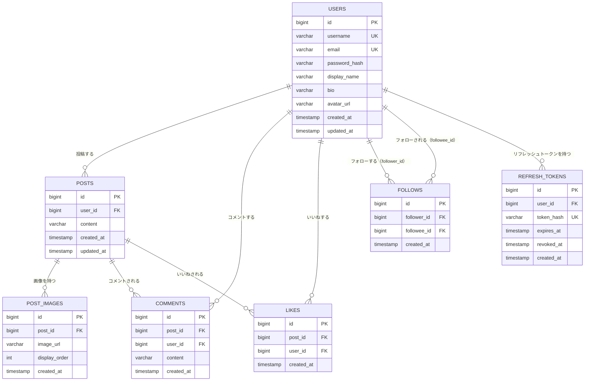

# 基本設計書：RaiseTechSNS（仮称）

[← 要件定義書に戻る](requirements.md)

## 改訂履歴

**1.0 / 2026-08-10**  
初版作成

**1.1 / 2026-08-10**  
技術スタックをTaskManagementプロジェクトと同一のバージョンに確定。データベース製品をPostgreSQLに確定

**1.2 / 2026-08-10**  
認証方式をJWTに確定。画像の保存先をS3に確定。投稿文字数の上限を280文字に確定。1投稿あたりの画像枚数を最大4枚に変更し、データベース設計に投稿画像テーブルを追加

**1.3 / 2026-08-10**  
ER図をMermaid記法（erDiagram）に変更

**1.4 / 2026-08-10**  
ユーザー検索の実装方針を追記（既存カラムのみで対応、新規テーブル・カラムは不要）

**1.5 / 2026-08-11**  
データアクセス層をSpring Data JPA/HibernateからMyBatis（XMLマッパー方式）に変更。学習中の講義でMyBatisを使用しているため、TaskManagementとの技術スタックの差分として明記

**1.6 / 2026-08-11**  
認証方式の詳細（アクセストークン＋リフレッシュトークン方式、トークンの保存場所、ログアウト時の無効化方法）を確定し、実装時に詳細設計するとしていた保留事項を反映。データベース設計にリフレッシュトークンテーブルを追加

**1.7 / 2026-08-12**  
タイムライン機能・投稿機能（テキストのみ）のAPI設計を追記（投稿の作成・一覧取得・編集・削除エンドポイント、カーソルベースのページネーション、ポーリングによる新着投稿のリアルタイム反映）。これに伴い「非機能要件」「要検討リスト」の章番号を1つ繰り下げ

**1.8 / 2026-08-12**  
新着投稿のリアルタイム反映方式を見直し。ポーリングで検知した投稿を一覧へ即座に反映する方式から、画面上部に固定表示する新着通知バナー（件数表示、クリックで反映＋最上部へスクロール）をクリックするまで反映を保留する方式に変更。あわせてポーリング間隔を10秒から30秒に変更

**1.9 / 2026-08-12**  
非機能要件の「未ログイン利用者がタイムライン閲覧以外を行えないようにする」という記述を修正。`functional-requirements.md`・`screen-design.md`の設計（タイムラインはログイン・会員登録成功後にしか到達しない）と整合するよう、未ログイン利用者は閲覧を含めいずれの機能も利用できない旨に表現を改めた（品質チェックで判明した記述の食い違いを解消）

## 1. システム構成

- フロントエンド（React）とバックエンド（Spring Boot）を分離した構成とする
- フロントエンドはSPA（Single Page Application）として動作し、バックエンドが提供するREST APIと通信する
- バックエンドはDBとやり取りし、フロントエンドにJSON形式でデータを返す

構成イメージ:

```
[ブラウザ] ⇔ [フロントエンド: React] ⇔ (REST API) ⇔ [バックエンド: Spring Boot] ⇔ [DB]
```

## 2. 技術スタック

姉妹プロジェクト[TaskManagement](../../TaskManagement)と同一の技術スタックを基本としつつ、データアクセス層のみ、受講中の講義に合わせてMyBatisを採用する（TaskManagementはSpring Data JPA + Hibernate）。

### バックエンド

- 言語：Java 25
- フレームワーク：Spring Boot 4.1.0
- Web：Spring Web（REST API）
- データアクセス：MyBatis（mybatis-spring-boot-starter 4.0.1、XMLマッパー方式）
- ビルドツール：Gradle 9.5.1
- JDBCドライバ：PostgreSQL JDBCドライバ 42.7.11

### フロントエンド

- 言語：TypeScript 6.0.3
- ライブラリ：React 19.2.8
- ビルドツール：Vite 8.1.5
- ランタイム：Node.js ^20.19.0 または >=22.12.0

### データベース

- DBMS：PostgreSQL 16（Dockerイメージ: `postgres:16-alpine`）

> バージョンはTaskManagement側の更新に追従する想定。実装スキャフォールド時に`backend/build.gradle`等の一次情報を作成したら、本節もあわせて更新する。

## 3. 認証方式

- Spring Security + JWTを用いた、アクセストークン＋リフレッシュトークンの2種類のトークンによる認証方式を採用する
- トークンの保存場所：どちらのトークンもHttpOnly Cookie（JavaScriptから読み取れない）で保持し、XSSによるトークン窃取のリスクを下げる。フロントエンドはトークンの値を一切扱わず、ブラウザが自動的にCookieを送信することでAPIリクエストを認証する（HTTPヘッダーへの手動付与は行わない）
- アクセストークン（`access_token`Cookie）：署名付きJWT。有効期限は短く（デフォルト15分）、期限切れ後はAPIリクエストが401になる
- リフレッシュトークン（`refresh_token`Cookie）：ランダムな不透明トークン（JWTではない）。有効期限は長く（デフォルト14日）、DBにハッシュ値のみを保存して失効管理する。認証系エンドポイント（`/api/auth/**`）以外には送られないようCookieの送信範囲を絞る
  - アクセストークンが失効した場合、フロントエンドは`POST /api/auth/refresh`を呼び、リフレッシュトークンをもとにアクセストークン・リフレッシュトークンの両方を再発行（ローテーション）する
  - ローテーションのたびに使用済みのリフレッシュトークンは失効させ、同じトークンの再利用はできない。既に失効済みのトークンが再度使われた場合はトークン漏えいの兆候とみなし、そのユーザーの全リフレッシュトークンを失効させる
  - ログアウト時は、両方のCookieを失効させると同時に、DB上のリフレッシュトークンも失効させる（クライアント側でCookieを消すだけでなく、サーバー側でも無効化する）
- サーバー側はアクセストークンの検証のみで本人確認するステートレス方式（リフレッシュトークンの失効状態を除き、セッション状態を保持しない）
- パスワードは平文で保存せず、ハッシュ化（BCrypt等）して保存する

## 4. データベース設計

### エンティティ一覧

- 利用者（users）：id, ユーザー名, メールアドレス, パスワードハッシュ, 表示名, 自己紹介, アイコン画像URL
- 投稿（posts）：id, 投稿者（利用者）, 本文, 投稿日時
- 投稿画像（post_images）：id, 投稿, 画像URL, 表示順
- コメント（comments）：id, 投稿, コメント者（利用者）, 本文, 投稿日時
- いいね（likes）：id, 投稿, いいねした利用者, 日時
- フォロー（follows）：id, フォローする利用者, フォローされる利用者, 日時
- リフレッシュトークン（refresh_tokens）：id, 利用者, トークンハッシュ, 有効期限, 失効日時

### テーブル定義

#### users

- id：BIGINT, PK, AUTO_INCREMENT
- username：VARCHAR(50), NOT NULL, UNIQUE
- email：VARCHAR(255), NOT NULL, UNIQUE
- password_hash：VARCHAR(255), NOT NULL
- display_name：VARCHAR(50), NOT NULL
- bio：VARCHAR(160), NULL可
- avatar_url：VARCHAR(500), NULL可
- created_at：TIMESTAMP, NOT NULL
- updated_at：TIMESTAMP, NOT NULL

#### posts

- id：BIGINT, PK, AUTO_INCREMENT
- user_id：BIGINT, FK → users.id, NOT NULL（投稿者）
- content：VARCHAR(280), NOT NULL
- created_at：TIMESTAMP, NOT NULL
- updated_at：TIMESTAMP, NOT NULL

#### post_images

- id：BIGINT, PK, AUTO_INCREMENT
- post_id：BIGINT, FK → posts.id, NOT NULL
- image_url：VARCHAR(500), NOT NULL（S3上の画像URL）
- display_order：INT, NOT NULL（投稿内での表示順、0始まり）
- created_at：TIMESTAMP, NOT NULL
- アプリケーション側のバリデーションで、1つのpostにつきpost_imagesは最大4件までに制限する

#### comments

- id：BIGINT, PK, AUTO_INCREMENT
- post_id：BIGINT, FK → posts.id, NOT NULL
- user_id：BIGINT, FK → users.id, NOT NULL（コメント者）
- content：VARCHAR(280), NOT NULL
- created_at：TIMESTAMP, NOT NULL

#### likes

- id：BIGINT, PK, AUTO_INCREMENT
- post_id：BIGINT, FK → posts.id, NOT NULL
- user_id：BIGINT, FK → users.id, NOT NULL（いいねした利用者）
- created_at：TIMESTAMP, NOT NULL
- UNIQUE制約：(post_id, user_id) の組み合わせ（同じ利用者が同じ投稿に2回いいねできないようにする）

#### follows

- id：BIGINT, PK, AUTO_INCREMENT
- follower_id：BIGINT, FK → users.id, NOT NULL（フォローする利用者）
- followee_id：BIGINT, FK → users.id, NOT NULL（フォローされる利用者）
- created_at：TIMESTAMP, NOT NULL
- UNIQUE制約：(follower_id, followee_id) の組み合わせ（同じ相手を2回フォローできないようにする）
- follower_id と followee_id が同じ値（自分自身のフォロー）にならないよう制約する

#### refresh_tokens

- id：BIGINT, PK, AUTO_INCREMENT
- user_id：BIGINT, FK → users.id, NOT NULL
- token_hash：VARCHAR(255), NOT NULL, UNIQUE（トークンの生の値ではなくSHA-256ハッシュを保存）
- expires_at：TIMESTAMP, NOT NULL
- revoked_at：TIMESTAMP, NULL可（失効済みの場合に日時が入る）
- created_at：TIMESTAMP, NOT NULL

### ER図



- 1人のusersは複数のpostsを持つ
- 1人のusersは複数のcommentsを投稿できる
- 1人のusersは複数のlikesを付けられる
- 1つのpostsは複数のpost_images（最大4件）・comments・likesを持つ
- followsは、users同士の多対多のフォロー関係を表す中間テーブル（follower_id：フォローする側、followee_id：フォローされる側）
- 1人のusersは複数のrefresh_tokensを持つ（同時に複数端末でログインしている場合など）

補足：いいね数・コメント数は、likes・commentsテーブルの件数を集計（COUNT）して算出する方針とし、posts側に件数を保持するカラムは設けない。データ量が増えて集計コストが問題になった場合は、集計値をキャッシュするカラムの追加を検討する。

### ユーザー検索の実装方針

- users.username・users.display_nameに対する部分一致（LIKE検索）で実現する。既存カラムのみで対応でき、新規テーブル・カラムの追加は不要
- 学習規模のデータ量（受講生・個人利用）を前提とし、全文検索エンジン等の追加インフラは導入しない
- データ量が増えて検索性能が問題になった場合は、username・display_nameへのインデックス追加を検討する

## 5. API設計

### 投稿API

タイムライン機能・投稿機能（テキストのみ）で追加したエンドポイント。いずれも認証必須（Cookieの`access_token`が必要、未ログインは401）。

| メソッド | パス | 説明 |
|---|---|---|
| GET | /api/posts?limit=\&beforeId=\&afterId= | 投稿一覧を新しい順（`id DESC`）に取得する |
| POST | /api/posts | 新しい投稿を作成する。リクエストボディ`{ content: string }`（1〜280文字） |
| PUT | /api/posts/{postId} | 自分の投稿の本文を編集する。他人の投稿を指定した場合は403 |
| DELETE | /api/posts/{postId} | 自分の投稿を削除する。他人の投稿を指定した場合は403 |

エラーレスポンスは認証APIと同様、Spring標準の`ProblemDetail`（RFC 7807）に統一する。

### ページネーション方式（カーソルベース）

一覧取得（`GET /api/posts`）は、offsetではなく`id`を基準にしたカーソルベースのページネーションを採用する。

- `limit`のみ指定：最新の投稿から取得する（既定20件、最大50件）
- `beforeId`を指定：そのidより古い（idが小さい）投稿を取得する。画面下端までスクロールした際の追加読み込み（無限スクロール）に使う
- `afterId`を指定：そのidより新しい（idが大きい）投稿を取得する。他利用者の新着投稿を検知する差分取得（後述のポーリング）に使う
- `beforeId`と`afterId`は同時に指定できない（同時指定時は400エラー）
- `limit`件を超えて（`limit+1`件）取得できた場合に`hasMore: true`を返す方式とし、追加のCOUNTクエリは行わない

`posts.id`はAUTO_INCREMENTかつ挿入順（＝`created_at`順）と完全に一致するため、カーソルに`created_at`ではなく`id`を使うことで、同時刻投稿のタイブレーク処理が不要になる。また、offset方式だと無限スクロール中に他利用者の新規投稿がタイムライン先頭に増えるたびに「次のページ」のoffsetがずれて重複・欠落が起きるが、`id`を基準にしたカーソル方式ではその問題が起きない。

### リアルタイム反映（ポーリング＋新着通知バナー）

他利用者の新規投稿を検知するため、フロントエンドは30秒間隔で`GET /api/posts?afterId=<既知の最新投稿のid>`をポーリングする。ただし検知した投稿は一覧（タイムライン）へ即座には反映しない。投稿中の作業や読んでいる位置をポーリングのたびに動かしてしまわないよう、画面上部に固定表示される新着通知バナー（例：「↑ 3件の新しい投稿があります」、ブラウザ標準のalert等は使わない独自UI）に件数だけを表示し、利用者がバナーをクリックしたタイミングで初めて新着投稿を一覧の先頭に反映し、画面を最上部までスクロールする。バナーは画面のスクロール位置によらず常に表示される。複数回のポーリングで新着投稿が見つかった場合は、バナーをクリックするまで件数が積み上がる。WebSocket等のプッシュ型の仕組みは導入せず、シンプルなポーリング方式とした。他利用者による投稿の編集・削除は、この差分取得の対象外のため自動反映されない（画面を再読み込みするまで反映されない）。

## 6. 非機能要件

- 動作環境：一般的なモダンブラウザ（Chrome等）で動作すること
- 性能：受講生・個人の学習利用を前提とし、大量アクセス・大量データは考慮しない
- セキュリティ：
  - パスワードはハッシュ化して保存する
  - 未ログイン利用者は、タイムラインの閲覧を含め、投稿・コメント・いいね・フォロー等いずれの機能も利用できないようにする（`functional-requirements.md`のユースケース・`screen-design.md`の画面遷移の通り、タイムラインへはログイン・会員登録成功後にしか到達しない）
- 画像アップロード：形式（jpg/png等）・サイズ（例：1枚あたり5MB以下）を制限し、Amazon S3に保存する。1投稿につき最大4枚まで添付できる
- データ永続化：DBにデータを永続化し、アプリ再起動後もデータを保持する

## 7. 要検討リスト

現時点で未決定の項目はない。今後、方針を変更する場合はここに追記する。
