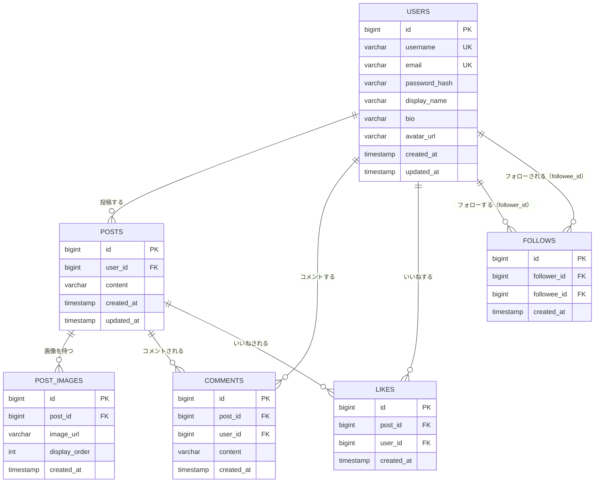

# 基本設計書：RaiseTechSNS（仮称）

[← 要件定義書に戻る](requirements.md)

## 改訂履歴

**1.0 / 2026-08-10**  
初版作成

**1.1 / 2026-08-10**  
技術スタックをTaskManagementプロジェクトと同一のバージョンに確定。データベース製品をPostgreSQLに確定

**1.2 / 2026-08-10**  
認証方式をJWTに確定。画像の保存先をS3に確定。投稿文字数の上限を280文字に確定。1投稿あたりの画像枚数を最大4枚に変更し、データベース設計に投稿画像テーブルを追加

**1.3 / 2026-08-10**  
ER図をMermaid記法（erDiagram）に変更

## 1. システム構成

- フロントエンド（React）とバックエンド（Spring Boot）を分離した構成とする
- フロントエンドはSPA（Single Page Application）として動作し、バックエンドが提供するREST APIと通信する
- バックエンドはDBとやり取りし、フロントエンドにJSON形式でデータを返す

構成イメージ:

```
[ブラウザ] ⇔ [フロントエンド: React] ⇔ (REST API) ⇔ [バックエンド: Spring Boot] ⇔ [DB]
```

## 2. 技術スタック

姉妹プロジェクト[TaskManagement](../../TaskManagement)と同一の技術スタックを採用する。

### バックエンド

- 言語：Java 25
- フレームワーク：Spring Boot 4.1.0
- Web：Spring Web（REST API）
- データアクセス：Spring Data JPA 4.1.0
- ORM：Hibernate 7.4.1.Final
- ビルドツール：Gradle 9.5.1
- JDBCドライバ：PostgreSQL JDBCドライバ 42.7.11

### フロントエンド

- 言語：TypeScript 6.0.3
- ライブラリ：React 19.2.8
- ビルドツール：Vite 8.1.5
- ランタイム：Node.js ^20.19.0 または >=22.12.0

### データベース

- DBMS：PostgreSQL 16（Dockerイメージ: `postgres:16-alpine`）

> バージョンはTaskManagement側の更新に追従する想定。実装スキャフォールド時に`backend/build.gradle`等の一次情報を作成したら、本節もあわせて更新する。

## 3. 認証方式

- Spring Security + JWT（JSON Web Token）を採用する
- ログイン成功時にサーバーが署名付きトークンを発行し、フロントエンドがそれを保持する。以降のAPIリクエストではHTTPヘッダーにトークンを付与し、サーバーは署名検証のみで本人確認する（サーバー側にセッション状態を保持しないステートレス方式）
- パスワードは平文で保存せず、ハッシュ化（BCrypt等）して保存する
- トークンの保存場所（XSS対策）、有効期限・リフレッシュトークンの扱い、ログアウト時のトークン無効化方法は、実装時に詳細設計する

## 4. データベース設計

### エンティティ一覧

- 利用者（users）：id, ユーザー名, メールアドレス, パスワードハッシュ, 表示名, 自己紹介, アイコン画像URL
- 投稿（posts）：id, 投稿者（利用者）, 本文, 投稿日時
- 投稿画像（post_images）：id, 投稿, 画像URL, 表示順
- コメント（comments）：id, 投稿, コメント者（利用者）, 本文, 投稿日時
- いいね（likes）：id, 投稿, いいねした利用者, 日時
- フォロー（follows）：id, フォローする利用者, フォローされる利用者, 日時

### テーブル定義

#### users

- id：BIGINT, PK, AUTO_INCREMENT
- username：VARCHAR(50), NOT NULL, UNIQUE
- email：VARCHAR(255), NOT NULL, UNIQUE
- password_hash：VARCHAR(255), NOT NULL
- display_name：VARCHAR(50), NOT NULL
- bio：VARCHAR(160), NULL可
- avatar_url：VARCHAR(500), NULL可
- created_at：TIMESTAMP, NOT NULL
- updated_at：TIMESTAMP, NOT NULL

#### posts

- id：BIGINT, PK, AUTO_INCREMENT
- user_id：BIGINT, FK → users.id, NOT NULL（投稿者）
- content：VARCHAR(280), NOT NULL
- created_at：TIMESTAMP, NOT NULL
- updated_at：TIMESTAMP, NOT NULL

#### post_images

- id：BIGINT, PK, AUTO_INCREMENT
- post_id：BIGINT, FK → posts.id, NOT NULL
- image_url：VARCHAR(500), NOT NULL（S3上の画像URL）
- display_order：INT, NOT NULL（投稿内での表示順、0始まり）
- created_at：TIMESTAMP, NOT NULL
- アプリケーション側のバリデーションで、1つのpostにつきpost_imagesは最大4件までに制限する

#### comments

- id：BIGINT, PK, AUTO_INCREMENT
- post_id：BIGINT, FK → posts.id, NOT NULL
- user_id：BIGINT, FK → users.id, NOT NULL（コメント者）
- content：VARCHAR(280), NOT NULL
- created_at：TIMESTAMP, NOT NULL

#### likes

- id：BIGINT, PK, AUTO_INCREMENT
- post_id：BIGINT, FK → posts.id, NOT NULL
- user_id：BIGINT, FK → users.id, NOT NULL（いいねした利用者）
- created_at：TIMESTAMP, NOT NULL
- UNIQUE制約：(post_id, user_id) の組み合わせ（同じ利用者が同じ投稿に2回いいねできないようにする）

#### follows

- id：BIGINT, PK, AUTO_INCREMENT
- follower_id：BIGINT, FK → users.id, NOT NULL（フォローする利用者）
- followee_id：BIGINT, FK → users.id, NOT NULL（フォローされる利用者）
- created_at：TIMESTAMP, NOT NULL
- UNIQUE制約：(follower_id, followee_id) の組み合わせ（同じ相手を2回フォローできないようにする）
- follower_id と followee_id が同じ値（自分自身のフォロー）にならないよう制約する

### ER図



- 1人のusersは複数のpostsを持つ
- 1人のusersは複数のcommentsを投稿できる
- 1人のusersは複数のlikesを付けられる
- 1つのpostsは複数のpost_images（最大4件）・comments・likesを持つ
- followsは、users同士の多対多のフォロー関係を表す中間テーブル（follower_id：フォローする側、followee_id：フォローされる側）

補足：いいね数・コメント数は、likes・commentsテーブルの件数を集計（COUNT）して算出する方針とし、posts側に件数を保持するカラムは設けない。データ量が増えて集計コストが問題になった場合は、集計値をキャッシュするカラムの追加を検討する。

## 5. 非機能要件

- 動作環境：一般的なモダンブラウザ（Chrome等）で動作すること
- 性能：受講生・個人の学習利用を前提とし、大量アクセス・大量データは考慮しない
- セキュリティ：
  - パスワードはハッシュ化して保存する
  - 未ログイン利用者がタイムライン閲覧以外（投稿・コメント・いいね・フォロー）を行えないようにする
- 画像アップロード：形式（jpg/png等）・サイズ（例：1枚あたり5MB以下）を制限し、Amazon S3に保存する。1投稿につき最大4枚まで添付できる
- データ永続化：DBにデータを永続化し、アプリ再起動後もデータを保持する

## 6. 要検討リスト

現時点で未決定の項目はない。今後、方針を変更する場合はここに追記する。
