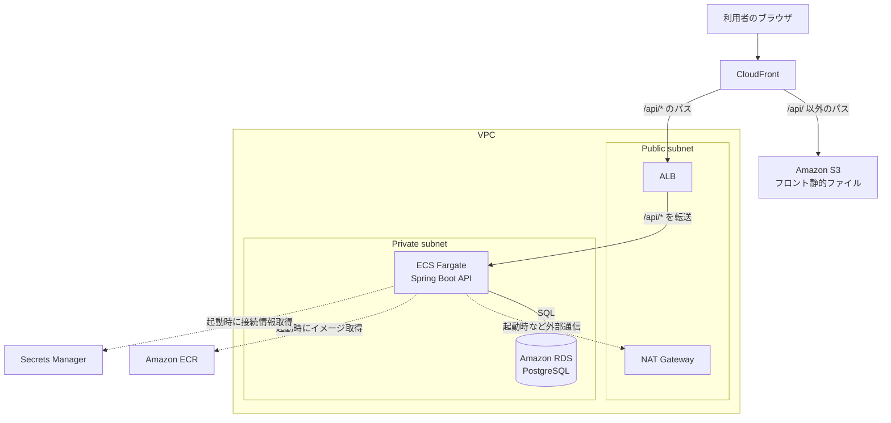

# インフラ構成書：RaiseTechSNS（仮称）

[← 基本設計書に戻る](basic-design.md)

## 改訂履歴

**1.0 / 2026-08-20**  
初版作成。EC2インスタンスを直接管理しない構成（S3 + CloudFront、ECS Fargate、RDS）を確定

**1.1 / 2026-08-20**  
本設計を`terraform/`配下にTerraformコードとして実装し、実際にAWS上へ構築・デプロイして動作確認した（会員登録・ログイン・投稿・アバターアップロードまで一通り確認済み）。独自ドメインは当面使わず、CloudFrontのデフォルトドメイン（`*.cloudfront.net`）で運用する方針を確定し、6章の要検討リストから外した。あわせて、アバター用S3の認証情報について、バックエンド（`S3Config.java`）がECSタスクロールベースの認証に対応しておらず常に静的アクセスキーを使う実装のため、IAMユーザーの静的アクセスキーをSecrets Manager経由でコンテナに注入する運用とした（3章参照）

## 1. 方針

- 本番環境の構築において、EC2インスタンスを直接作成・管理しない方針とする
- フロントエンド（静的ファイル）とバックエンドAPI（コンテナ）を分離し、それぞれAWSのマネージドサービス上で動かす
- サーバーのOS・ミドルウェアのパッチ適用やスケーリングといった運用作業は、可能な限りAWS側に任せる構成とする
- 上記の構成は`terraform/`配下にコード化されており、`terraform apply`で再現・`terraform destroy`で撤去できる

## 2. 全体構成図

実線は常時発生する通信、破線はコンテナ起動時など随時発生する通信を表す。CloudFrontが`/api/`から始まるパスかどうかでS3行き・ALB行きを振り分ける点が、この構成のかなめである（詳細は4章）。

## 3. コンポーネント一覧

### フロントエンド配信

- Amazon S3  
  Reactをビルドした静的ファイル（HTML/CSS/JS）を保管する。バケット自体は非公開にし、CloudFront（OAC：Origin Access Control）経由のみでアクセスを許可する
- Amazon CloudFront  
  S3の手前に立てるCDN（Content Delivery Network）。HTTPS終端・キャッシュを行うほか、パスベースのルーティング（4章）でフロントとAPIを同一オリジンに見せる役割も担う

### バックエンドAPI実行

- Amazon ECR  
  バックエンド（`backend/Dockerfile`）から作成したDockerイメージを保管する
- Amazon ECS + AWS Fargate  
  ECRのイメージをコンテナとして実行する。Fargateを使うことで、実行基盤となるEC2インスタンスの用意・パッチ適用・スケーリングをAWS側に任せられる
- Application Load Balancer（ALB）  
  CloudFrontから転送された`/api/*`宛のリクエストを、ECS Fargateタスクへ振り分ける

### データベース

- Amazon RDS for PostgreSQL  
  PostgreSQL 16をマネージドサービスとして構築する。構築・バックアップ・パッチ適用はAWS側が担う。Private subnetに配置し、ECS FargateタスクのセキュリティグループからのみIn boundを許可する

### ネットワーク

- Amazon VPC  
  本番環境専用の仮想ネットワークを新規作成する
- サブネット（Public / Private）  
  ALB・NAT GatewayはPublic subnetに、ECS Fargateタスク・RDSはPrivate subnetに配置し、DB・アプリ実行環境をインターネットから直接到達不能にする
- NATゲートウェイ  
  Private subnet内のECS Fargateタスクが、ECRからのイメージ取得等で外部通信する際の出口として使う

### シークレット・証明書・DNS

- AWS Secrets Manager  
  DB接続情報・JWT署名鍵に加え、アバター用S3のIAMアクセスキーも保管し、ECSタスク定義から参照する。`S3Config.java`が常に静的アクセスキー（`StaticCredentialsProvider`）でS3クライアントを構築する実装のため、ECSタスクロールにS3権限を付与しても参照されない。恒久対応としては`S3Config`側にタスクロールベースの認証（`DefaultCredentialsProvider`）へのフォールバックを追加することが望ましいが、今回はスコープ外とし、IAMユーザーの静的アクセスキーで運用する
- AWS Certificate Manager（ACM）  
  独自ドメインを使う場合にCloudFront用証明書（us-east-1リージョン必須）・ALB用証明書を発行する。当面は独自ドメインを使わないため未使用（CloudFrontのデフォルト証明書で運用）
- Amazon Route 53  
  独自ドメインを使う場合のDNS管理に使う。当面は使わない方針とした（改訂履歴1.1参照）

## 4. フロントとAPIの同一オリジン化（Cookie対策）

[基本設計書の認証方式](basic-design.md#3-認証方式)の通り、認証はHttpOnly Cookie（`access_token`/`refresh_token`）方式を採用している。フロントエンド（CloudFront）とバックエンドAPI（ALB）が別ドメインになると、ブラウザのCookie送信制御（`SameSite`等）の影響で、認証Cookieが正しく送信されない場合がある。

これを避けるため、CloudFrontの1ディストリビューションに2つのオリジン（S3・ALB）を設定し、パスベースのビヘイビアでルーティングする。

- `/api/*` → ALB（Spring Boot API）
- それ以外 → S3（React静的アセット）

ブラウザから見ると単一オリジンになるため、認証方式・Cookie設定を変更せずにそのまま運用できる。

なお、実装時にバックエンドのCORS許可オリジン（`SecurityConfig.java`・`WebConfig.java`）が開発用の`http://localhost:5173`にハードコードされていることが判明した。ブラウザは同一オリジンであっても状態変化を伴うリクエスト（POST/PUT/DELETE）で`Origin`ヘッダーを送るため、本番のCloudFrontドメインがこの許可リストに含まれないままだと会員登録・ログイン等が失敗する。`allowCredentials(true)`と組み合わせてワイルドカードを使うため、`setAllowedOrigins`ではなく`setAllowedOriginPatterns`に変更し、`https://*.cloudfront.net`を許可パターンに追加して対応した。

## 5. コスト・運用上の補足

- NAT Gatewayは時間課金が発生するため、学習規模のトラフィックであればVPCエンドポイント（ECR・S3・Secrets Manager宛）への置き換えでコストを抑える選択肢もある。本バージョンではシンプルさを優先しNAT Gatewayを採用する
- RDS・ECS Fargateともに、学習規模のデータ量・アクセス量を前提とした最小構成（最小インスタンスクラス・最小タスク数）とする
- 検証後は`terraform destroy`で撤去する運用とし、常時稼働はさせない（ALB・NAT Gateway・RDS等は稼働時間に応じて課金されるため）

## 6. 今回の実装で残した既知の妥協点

いずれも学習・検証目的であれば許容できる妥協だが、恒久的に運用する場合は見直しが必要になる。

- **S3の静的IAM認証情報**：3章参照。恒久対応は`S3Config.java`のタスクロール対応
- **ALB〜CloudFront間はHTTP**：独自ドメイン・ACM証明書を導入しない限り解消できない（ACMはAWS所有ドメインには証明書を発行できないため）。CloudFrontエッジ〜ブラウザ間はHTTPSで保護されている
- **ALBの保護はCloudFrontのオリジンフェイシングIPレンジ（AWS管理プレフィックスリスト）のみ**：「自分のディストリビューション限定」ではなく「AWS上の全CloudFrontエッジ」からの到達を許すものであり、第三者が別のディストリビューションでこのALBをオリジンに指定すれば到達できてしまう限界がある。恒久対応はCloudFrontのカスタムヘッダー共有シークレット＋ALBリスナールールでの検証
- **Terraformのstateをローカル保存**：DBパスワード・IAMアクセスキー等が平文で`terraform/`配下のtfstateに残る（`.gitignore`で誤コミットは防止済み）。恒久運用するならS3リモートバックエンド＋暗号化が必要

## 7. 要検討リスト

- CI/CD（ECRへのイメージpush、ECSへのデプロイの自動化）の方式
