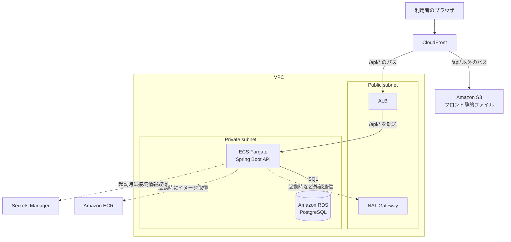

# インフラ構成書：RaiseTechSNS（仮称）

[← 基本設計書に戻る](basic-design.md)

## 改訂履歴

**1.0 / 2026-08-20**  
初版作成。EC2インスタンスを直接管理しない構成（S3 + CloudFront、ECS Fargate、RDS）を確定

## 1. 方針

- 本番環境の構築において、EC2インスタンスを直接作成・管理しない方針とする
- フロントエンド（静的ファイル）とバックエンドAPI（コンテナ）を分離し、それぞれAWSのマネージドサービス上で動かす
- サーバーのOS・ミドルウェアのパッチ適用やスケーリングといった運用作業は、可能な限りAWS側に任せる構成とする

## 2. 全体構成図

実線は常時発生する通信、破線はコンテナ起動時など随時発生する通信を表す。CloudFrontが`/api/`から始まるパスかどうかでS3行き・ALB行きを振り分ける点が、この構成のかなめである（詳細は4章）。

## 3. コンポーネント一覧

### フロントエンド配信

- Amazon S3  
  Reactをビルドした静的ファイル（HTML/CSS/JS）を保管する。バケット自体は非公開にし、CloudFront（OAC：Origin Access Control）経由のみでアクセスを許可する
- Amazon CloudFront  
  S3の手前に立てるCDN（Content Delivery Network）。HTTPS終端・キャッシュを行うほか、パスベースのルーティング（4章）でフロントとAPIを同一オリジンに見せる役割も担う

### バックエンドAPI実行

- Amazon ECR  
  バックエンド（`backend/Dockerfile`）から作成したDockerイメージを保管する
- Amazon ECS + AWS Fargate  
  ECRのイメージをコンテナとして実行する。Fargateを使うことで、実行基盤となるEC2インスタンスの用意・パッチ適用・スケーリングをAWS側に任せられる
- Application Load Balancer（ALB）  
  CloudFrontから転送された`/api/*`宛のリクエストを、ECS Fargateタスクへ振り分ける

### データベース

- Amazon RDS for PostgreSQL  
  PostgreSQL 16をマネージドサービスとして構築する。構築・バックアップ・パッチ適用はAWS側が担う。Private subnetに配置し、ECS FargateタスクのセキュリティグループからのみIn boundを許可する

### ネットワーク

- Amazon VPC  
  本番環境専用の仮想ネットワークを新規作成する
- サブネット（Public / Private）  
  ALB・NAT GatewayはPublic subnetに、ECS Fargateタスク・RDSはPrivate subnetに配置し、DB・アプリ実行環境をインターネットから直接到達不能にする
- NATゲートウェイ  
  Private subnet内のECS Fargateタスクが、ECRからのイメージ取得等で外部通信する際の出口として使う

### シークレット・証明書・DNS

- AWS Secrets Manager  
  DB接続情報・JWT署名鍵など、ECSタスク定義から参照する秘密情報を保管する
- AWS Certificate Manager（ACM）  
  CloudFront用証明書（us-east-1リージョン必須）・ALB用証明書を発行する
- Amazon Route 53  
  独自ドメインを使う場合のDNS管理に使う（6章の通り未確定）

## 4. フロントとAPIの同一オリジン化（Cookie対策）

[基本設計書の認証方式](basic-design.md#3-認証方式)の通り、認証はHttpOnly Cookie（`access_token`/`refresh_token`）方式を採用している。フロントエンド（CloudFront）とバックエンドAPI（ALB）が別ドメインになると、ブラウザのCookie送信制御（`SameSite`等）の影響で、認証Cookieが正しく送信されない場合がある。

これを避けるため、CloudFrontの1ディストリビューションに2つのオリジン（S3・ALB）を設定し、パスベースのビヘイビアでルーティングする。

- `/api/*` → ALB（Spring Boot API）
- それ以外 → S3（React静的アセット）

ブラウザから見ると単一オリジンになるため、認証方式・Cookie設定を変更せずにそのまま運用できる。

## 5. コスト・運用上の補足

- NAT Gatewayは時間課金が発生するため、学習規模のトラフィックであればVPCエンドポイント（ECR・S3・Secrets Manager宛）への置き換えでコストを抑える選択肢もある。本バージョンではシンプルさを優先しNAT Gatewayを採用する
- RDS・ECS Fargateともに、学習規模のデータ量・アクセス量を前提とした最小構成（最小インスタンスクラス・最小タスク数）とする

## 6. 要検討リスト

- 独自ドメインを取得するかどうか（取得する場合はRoute 53・ACMの対象ドメインを確定する）
- CI/CD（ECRへのイメージpush、ECSへのデプロイの自動化）の方式
